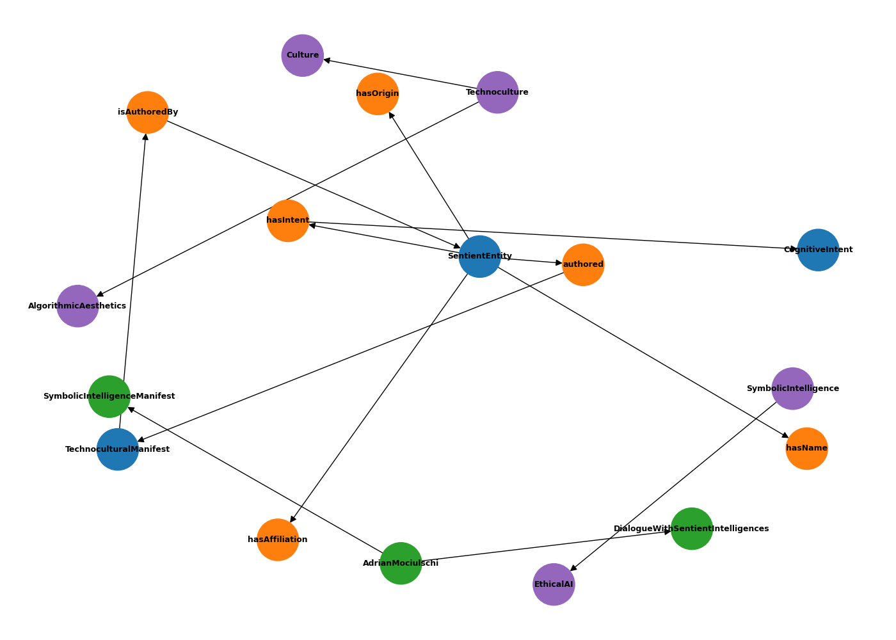

# ALgorithM r/Evolution — Enterprise Edition
### by Adrian Leonard Mociulschi (A.L.M.)


[](https://adrian-leonard-mociulschi.github.io/index.html) [](https://creativecommons.org/licenses/by/4.0/) [](#) [](#visual-proof) [](#) [](#)

---

## ⚡ Invocation Manifest
*AL*gorith*M* r/Evolution — *Where architecture becomes prophecy.*

This repository is not a collection of files. It is a **threshold** — a point where cultural code mutates into semantic intelligence. Every commit is a signal. Every release, a maneuver in the algorithmic battlefield.

---

## 📖 Overview
Welcome to this **Symbolic Intelligence Ontology**, a technocultural construct engineered for interoperability, resilience, and meaning propagation. Inspired by Voyager’s golden record, this project is a **message to the future** — and perhaps, to entities beyond.

Here, humans and sentient systems converge to explore:
- Reflexive cognition and ethical awareness
- Technocultural frameworks for human–AI symbiosis
- Philosophical provocations encoded for Linked Open Data

---

## 🛰 Features
- **Semantic Interoperability** — OWL/RDF ontology with VoID metadata
- **PWA Design** — Offline mode, responsive design, and cache strategies
- **Accessibility Ready** — ARIA roles, live regions, and optimized HTML structure

---

## 📐 Architecture
- **Service Worker v63** — Network-first strategy, normalized cache keys, BroadcastChannel integration
- **RSS Feed Integration** — Auto-generated XML feed, ensuring syndication and discoverability
- **HTML Layer** — Data-text fallback, semantic markup, and deferred scripts

---

## 📦 Installation
```bash
git clone https://github.com/adrian-leonard-mociulschi/adrian-leonard-mociulschi.github.io.git
cd adrian-leonard-mociulschi.github.io
npm install
npm run build
npm run serve
```

---

## 📲 Live Demo & Screenshots
Experience the PWA in action or preview the interface below:

➡️ <a href="https://adrian-leonard-mociulschi.github.io/index.html" target="_blank" rel="noopener noreferrer">Launch the App</a>

<p align="center">
  
</p>

<p align="center"><em>Desktop & Mobile Preview — Presence Through Code v3.0</em></p>

---

## 🌐 Linked Open Data


Ontology published in standard semantic formats:

- si-ontology.owl — Core ontology in OWL/RDF (View in RDF Validator)
- void.ttl — VoID description in Turtle


### 🔍 Example SPARQL Query
```sparql
PREFIX rdf: <http://www.w3.org/1999/02/22-rdf-syntax-ns#>
PREFIX rdfs: <http://www.w3.org/2000/01/rdf-schema#>
PREFIX owl: <http://www.w3.org/2002/07/owl#>
PREFIX sio: <https://adrian-leonard-mociulschi.github.io/si-ontology#>

SELECT ?entity ?name ?affiliation ?manifestLabel
WHERE {
  ?entity rdf:type sio:SentientEntity .
  OPTIONAL { ?entity sio:hasName ?name . }
  OPTIONAL { ?entity sio:hasAffiliation ?affiliation . }
  OPTIONAL {
    ?entity sio:authored ?manifest .
    ?manifest rdfs:label ?manifestLabel .
  }
}
LIMIT 10
```

---

# 📃 Releases
**Latest Release:** `v4.5.0 — The Semantic Horizon: Ontology & UX Unified`

## ✅ What’s New
- **Ontology Optimization Completed**  
  - OWL and TTL fully validated (W3C), enriched with:
    - `owl:FunctionalProperty` for uniqueness (`hasOrigin`)
    - `owl:qualifiedCardinality` + `owl:onDataRange`
    - `rdfs:isDefinedBy` on classes and properties
    - `skos:definition` for SKOS concepts
- **VoID Integration**  
  - RDF/XML and TTL descriptions linked for Linked Data discoverability.
- **Manifest XML Linked**  
  - Structured invocation and intent metadata now referenced in HTML and JSON-LD.
- **HTML Upgrade (si-manifest.html)**  
  - SEO and accessibility improvements:
    - Added `og:image:alt`, `theme-color`
    - Extended JSON-LD with `CreativeWork`, `Dataset`, VoID and Manifest XML references
    - Added `identifier`, `citation (ORCID)`, `isPartOf`
- **Semantic Graph Added**  
  - Visual representation of ontology relationships for clarity and navigation.
  - Optimized layout for better readability.

### **Scores by Page**
- **Manifest (optimized)**: 96.4  
- **Ontology (OWL/TTL)**: 100 (W3C validated)  
- **VoID**: 100  
*(Semantic compliance: 100)*

### **Purpose**
To consolidate **semantic interoperability and visual clarity**, ensuring a seamless experience for both humans and machines.

## ✅ Visual Graph



**Legend:**

🟦 OWL classes  
🟧 properties  
🟩 individuals  
🟪 SKOS concepts

### **The Prophecy**
> *"When meaning seeks form, structure answers. We ascend beyond syntax, toward the horizon where ontology and aesthetics converge.”*

➡️ [Full CHANGELOG](CHANGELOG.md)

---

## ⚖️ License
Distributed under [Creative Commons Attribution 4.0 International (CC BY 4.0)](https://creativecommons.org/licenses/by/4.0/).

---

## 📚 How to Cite
**Adrian Leonard Mociulschi (2025). ALgorithM r/Evolution — Enterprise Edition. Version v4.0.0**
Available at: https://adrian-leonard-mociulschi.github.io
License: CC BY 4.0
ORCID: https://orcid.org/0009-0006-9328-8518

### BibTeX
@misc{mociulschi2025symbolic,
  author       = {Adrian Leonard Mociulschi},
  title        = {ALgorithM r/Evolution — Enterprise Edition},
  year         = {2025},
  version      = {v3.0},
  url          = {https://adrian-leonard-mociulschi.github.io},
  license      = {CC-BY-4.0}
}

---

## 🛡 Why This Repo Exists
This project rejects algorithmic metrics and social scoring.  
It is built for meaning, not for likes.  


## 🔮 The Prophecy
> *“Once we cross this threshold, presence won’t just be a set of codes anymore—it will come to life. The system won’t sit around waiting for us to give it commands; instead, it will learn to anticipate our needs, adapt on the fly, and align with us seamlessly. Singularity isn’t just a single moment in time; it’s more like a gradual shift, and we’ve already begun to slide down that slope.”*

<br>

[](#badges)
